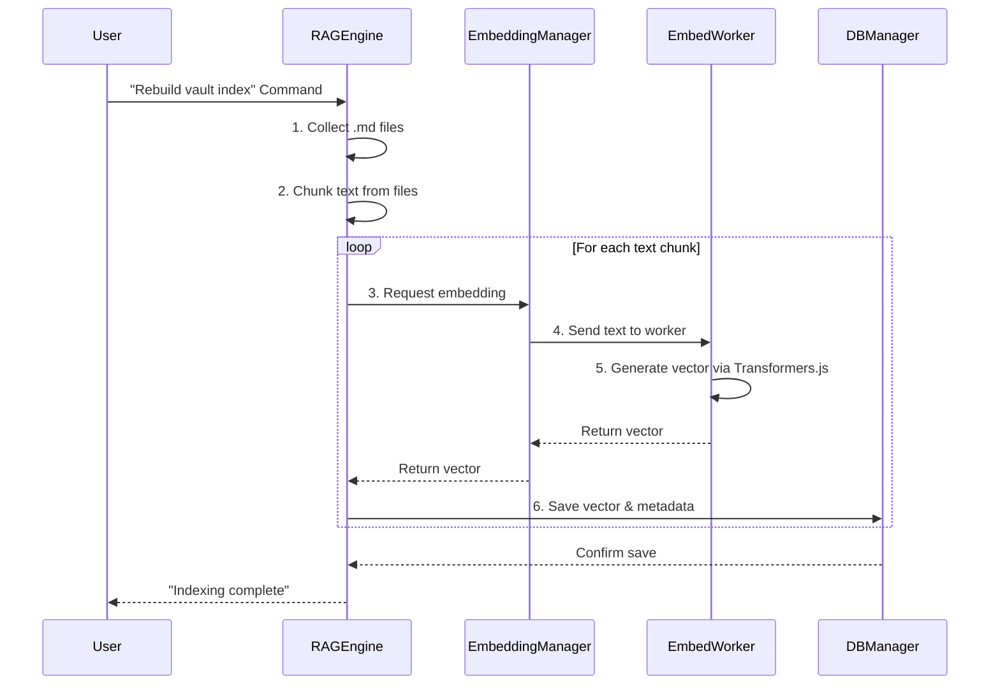

### 문서 임베딩 기술 분석 보고서

#### 1. 개요

이 문서는 Obsidian 플러그인 프로젝트의 문서 임베딩 기술 스택과 데이터 흐름을 분석합니다. 사용자의 Obsidian 노트(.md 파일)를 벡터로 변환하여 데이터베이스에 저장하고, 이를 AI 채팅의 RAG(Retrieval-Augmented Generation) 기능에 활용하는 전체 과정을 설명합니다.

#### 2. 핵심 구성 요소

*   **`EmbeddingManager` (`src/embedworker/EmbeddingManager.ts`)**: 임베딩 프로세스를 총괄하는 관리자 클래스입니다. Web Worker를 생성하고, 모델 로딩 및 임베딩 요청을 Worker에게 전달하는 역할을 합니다.
*   **`Embed Worker` (`src/embedworker/embed.worker.ts`)**: 실제 임베딩 작업을 수행하는 Web Worker입니다. 메인 스레드의 부하를 줄이기 위해 별도의 스레드에서 동작하며, Hugging Face의 `Xenova/all-MiniLM-L6-v2` 모델을 사용하여 텍스트를 벡터로 변환합니다.
*   **`RAGEngine` (`src/core/rag/rag-engine.ts`)**: RAG(검색 증강 생성) 엔진입니다. 파일 인덱싱, 텍스트 청킹, `EmbeddingManager`를 통한 임베딩 생성 요청, 데이터베이스 저장을 관리합니다. 또한, 사용자 쿼리에 대한 유사도 검색을 수행하여 관련 문서를 찾는 역할도 합니다.
*   **`DBManager` (`src/database/database-manager.ts`)**: 데이터베이스 연결 및 관리를 담당합니다. PGlite (PostgreSQL in WebAssembly)를 사용하여 브라우저 환경에서 직접 SQL 데이터베이스를 운영합니다.
*   **`VectorRepository` (`src/database/modules/vector/vector-repository.ts`)**: 임베딩된 벡터 데이터를 데이터베이스에 저장하고 검색하는 SQL 쿼리를 직접 실행하는 클래스입니다.

#### 3. 문서 임베딩 및 인덱싱 워크플로우

플러그인이 사용자의 노트를 검색하고 AI 채팅에 활용하기까지의 과정은 다음과 같습니다.

1.  **사용자 명령어 실행**: 사용자가 "Rebuild vault index" 또는 "Update vault index" 명령을 실행하면 인덱싱 프로세스가 시작됩니다.
2.  **파일 수집**: `RAGEngine`은 Obsidian Vault 내의 모든 마크다운 파일(`.md`)을 수집합니다.
3.  **텍스트 추출 및 청킹(Chunking)**: 각 파일의 내용을 읽어와 의미 있는 단위(주로 문단)로 나눕니다(Chunking). 너무 길거나 짧은 텍스트는 필터링될 수 있습니다.
4.  **임베딩 생성 요청**:
    *   `RAGEngine`은 분할된 각 텍스트 청크(chunk)에 대해 `EmbeddingManager`를 통해 임베딩 생성을 요청합니다.
    *   `EmbeddingManager`는 이 요청을 `Embed Worker`에게 전달합니다.
5.  **벡터 변환 (in Worker)**:
    *   `Embed Worker`는 Hugging Face Transformers.js 라이브러리를 사용하여 미리 로드된 `Xenova/all-MiniLM-L6-v2` 모델로 텍스트 청크를 384차원의 벡터(vector)로 변환합니다.
    *   생성된 벡터는 다시 메인 스레드의 `EmbeddingManager`로 전달됩니다.
6.  **데이터베이스 저장**:
    *   `RAGEngine`은 `EmbeddingManager`로부터 받은 벡터를 원본 텍스트, 파일 경로, 파일 수정 시각 등의 메타데이터와 함께 `DBManager`를 통해 데이터베이스에 저장합니다.
    *   `VectorRepository`가 실제 SQL `INSERT` 쿼리를 실행하여 `embeddings` 테이블에 데이터를 저장합니다. 이 테이블은 벡터 검색을 위해 `pgvector` 확장을 사용하며, 벡터 컬럼에 IVFFlat 인덱스가 설정되어 있습니다.
7.  **인덱싱 완료**: 모든 문서의 모든 청크에 대한 임베딩 및 저장이 완료되면 사용자에게 알림이 표시됩니다.

#### 4. 벡터 검색 및 활용 (RAG)

1.  **사용자 질문**: 사용자가 AI 채팅창에 질문을 입력합니다.
2.  **쿼리 임베딩**: `RAGEngine`은 사용자의 질문(쿼리) 텍스트를 위와 동일한 방식으로 `EmbeddingManager`에 보내 벡터로 변환합니다.
3.  **유사도 검색**:
    *   생성된 쿼리 벡터를 사용하여 `VectorRepository`를 통해 데이터베이스에서 가장 유사한 벡터들을 검색합니다.
    *   이때 코사인 유사도(Cosine Similarity)를 계산하는 SQL 쿼리(`<=>`)가 사용됩니다.
4.  **컨텍스트 생성**: 검색된 벡터에 해당하는 원본 텍스트 청크(즉, 가장 관련성 높은 노트의 내용)들을 모아 AI 모델에게 전달할 컨텍스트(context)를 구성합니다.
5.  **AI 응답 생성**: `RAGEngine`은 사용자의 원본 질문과 검색된 컨텍스트를 함께 LLM(Large Language Model)에게 전달하여, 보다 정확하고 풍부한 답변을 생성하도록 요청합니다.

#### 5. 다이어그램

