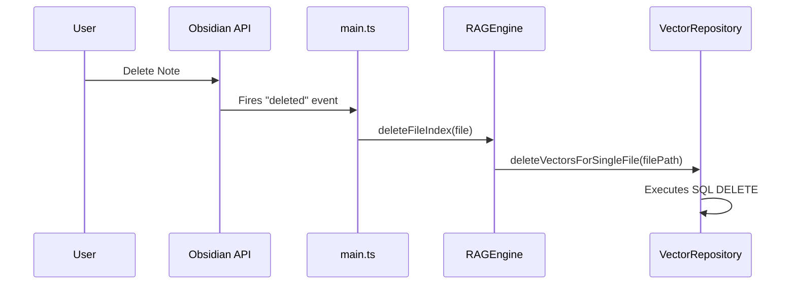

### 증분 업데이트 기술 분석 보고서

#### 1. 개요

이 문서는 Obsidian 노트의 생성, 수정, 삭제 이벤트가 발생했을 때, 벡터 데이터베이스가 어떻게 증분적으로(Incrementally) 업데이트되는지 기술적인 과정을 분석합니다. 이 플러그인은 실시간 자동 업데이트와 수동 업데이트 방식을 조합하여 효율성과 데이터 정합성을 관리합니다.

#### 2. 핵심 구성 요소 및 이벤트 리스너

*   **`InfioPlugin` (`src/main.ts`)**: 플러그인의 메인 클래스로, Obsidian 앱의 파일 시스템 이벤트를 감지하는 리스너를 등록합니다.
    *   `app.metadataCache.on("changed", ...)`: 파일 내용이 변경되거나 파일이 생성될 때 발생하는 이벤트를 감지합니다.
    *   `app.metadataCache.on("deleted", ...)`: 파일이 삭제될 때 발생하는 이벤트를 감지합니다.
*   **`RAGEngine` (`src/core/rag/rag-engine.ts`)**: RAG(검색 증강 생성) 엔진으로, 파일 인덱싱, 업데이트, 삭제 로직을 포함합니다.
    *   `updateFileIndex(file)`: 단일 파일을 다시 인덱싱하는 메소드.
    *   `deleteFileIndex(file)`: 단일 파일의 인덱스를 삭제하는 메소드.
    *   `updateVaultIndex({ reindexAll: boolean })`: 전체 Vault를 대상으로 인덱스를 업데이트하는 메소드. `reindexAll: false`일 경우 증분 업데이트를 수행합니다.
*   **`VectorRepository` (`src/database/modules/vector/vector-repository.ts`)**: 데이터베이스에 직접 SQL 쿼리를 실행하여 벡터 데이터를 관리합니다.
    *   `deleteVectorsForSingleFile(filePath)`: 특정 파일 경로에 해당하는 모든 벡터를 DB에서 삭제합니다.
    *   `insertVectors(data)`: 새로운 벡터 데이터를 DB에 추가합니다.
    *   `getMaxMtime()`: DB에 저장된 모든 벡터 중 가장 최신 수정 시각(`mtime`)을 가져옵니다.

#### 3. 증분 업데이트 워크플로우

파일의 생명주기(생성, 수정, 삭제)에 따라 업데이트 방식이 다르게 처리됩니다.

##### 가. 파일 삭제 (실시간 자동 처리)

파일 삭제는 실시간으로 감지되어 자동으로 처리됩니다.

1.  **이벤트 감지**: 사용자가 Obsidian에서 노트를 삭제하면 `app.metadataCache.on("deleted")` 이벤트가 발생합니다.
2.  **삭제 요청**: `main.ts`의 이벤트 리스너는 `RAGEngine.deleteFileIndex(file)` 메소드를 즉시 호출합니다.
3.  **DB에서 삭제**: `RAGEngine`은 `VectorRepository.deleteVectorsForSingleFile(file.path)`를 호출하여, 해당 파일 경로(`path`)를 가진 모든 벡터 데이터를 데이터베이스에서 `DELETE` 쿼리로 삭제합니다.



##### 나. 파일 생성 및 수정 (수동 업데이트 기반)

파일 생성 및 수정은 잦은 업데이트로 인한 성능 저하를 방지하기 위해, 기본적으로는 **수동 업데이트**를 통해 처리됩니다.

1.  **이벤트 감지**: 파일이 생성되거나 수정되면 `app.metadataCache.on("changed")` 이벤트가 발생합니다.
2.  **자동 업데이트 비활성화**: `main.ts`의 해당 이벤트 리스너 내에서 `ragEngine?.updateFileIndex(file)`를 호출하는 코드는 현재 주석 처리(`//`) 되어 있습니다. 이는 모든 변경사항에 대해 실시간으로 인덱싱을 수행하는 것이 비효율적이라는 판단 때문입니다.
3.  **수동 업데이트 실행**: 사용자가 "Update vault index" 명령을 실행하면 `RAGEngine.updateVaultIndex({ reindexAll: false })`가 호출되어 증분 업데이트가 시작됩니다.
4.  **증분 업데이트 로직**:
    *   `VectorRepository.getMaxMtime()`을 호출하여 DB에 기록된 가장 최신 파일 수정 시각(`lastIndexedTime`)을 가져옵니다.
    *   Obsidian Vault의 모든 마크다운 파일을 순회합니다.
    *   각 파일의 수정 시각(`file.stat.mtime`)과 `lastIndexedTime`을 비교합니다.
    *   만약 `file.stat.mtime > lastIndexedTime` 이거나 DB에 해당 파일 경로가 존재하지 않으면, 해당 파일을 **업데이트 대상**으로 지정합니다.
    *   업데이트 대상 파일에 대해 `updateFileIndex` 로직(기존 벡터 삭제 후 신규 벡터 삽입)을 수행합니다.

```mermaid
sequenceDiagram
    participant User
    participant RAGEngine
    participant VectorRepository
    participant Obsidian Vault

    User->>RAGEngine: "Update vault index" Command
    RAGEngine->>VectorRepository: getMaxMtime()
    VectorRepository-->>RAGEngine: lastIndexedTime
    RAGEngine->>Obsidian Vault: Get all .md files
    loop For each file
        RAGEngine->>RAGEngine: if file.mtime > lastIndexedTime
            RAGEngine->>RAGEngine: Mark for update
        end
    end
    loop For each marked file
        RAGEngine->>RAGEngine: updateFileIndex(file)
    end
```

#### 4. 결론

이 플러그인은 리소스 사용량과 데이터 최신성 사이의 균형을 맞추기 위해 전략적인 증분 업데이트 방식을 채택하고 있습니다.

*   **삭제**: 데이터의 정합성을 위해 실시간으로 자동 처리됩니다.
*   **생성/수정**: 잦은 I/O 작업을 피하고 성능을 유지하기 위해 사용자가 직접 명령을 실행하는 수동 업데이트 방식을 기본으로 합니다. 이를 통해 사용자가 원하는 시점에 여러 변경사항을 한 번에 효율적으로 DB에 반영할 수 있습니다.
